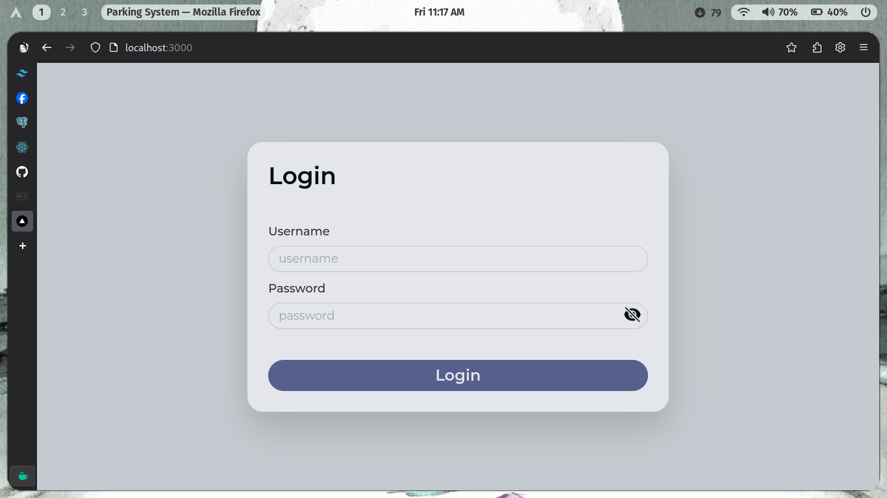
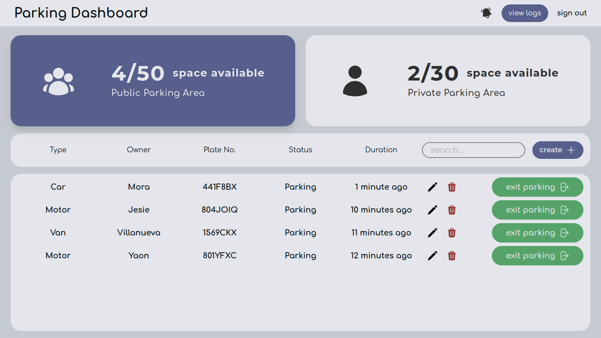
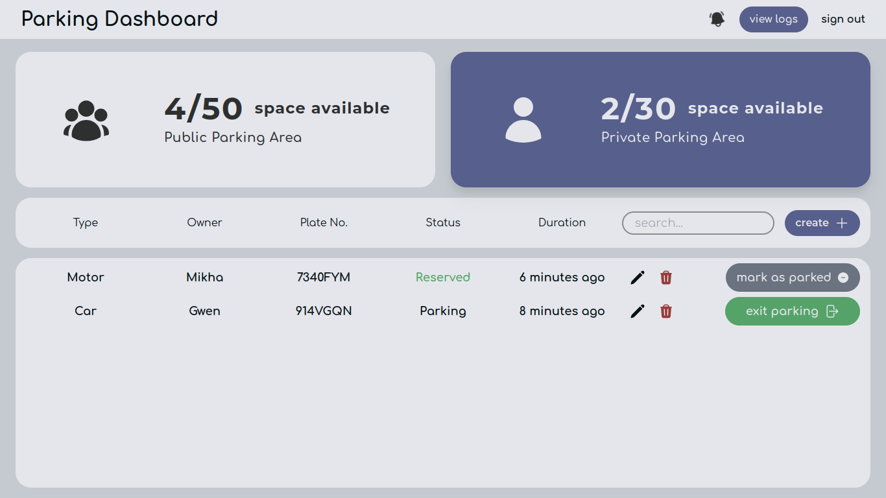
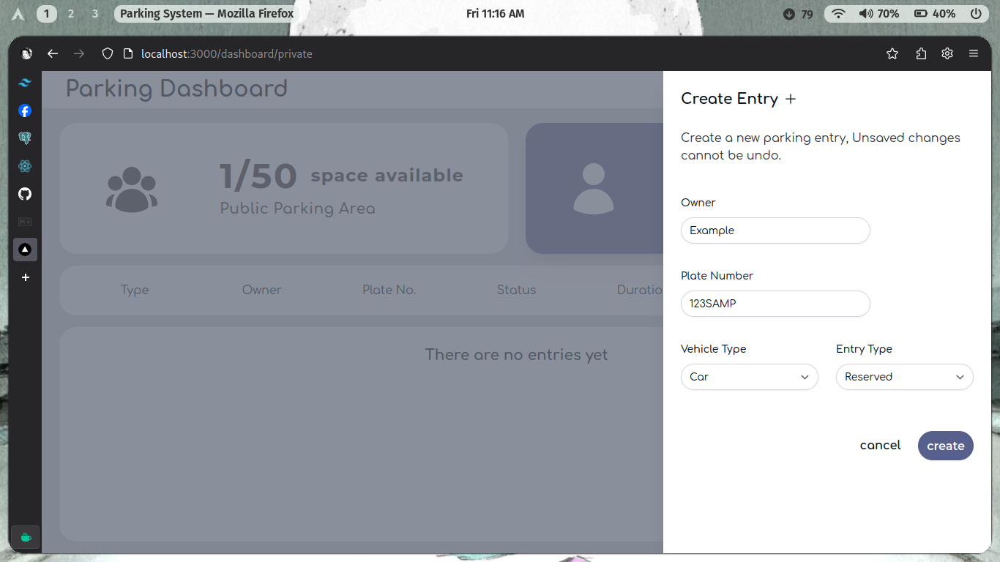
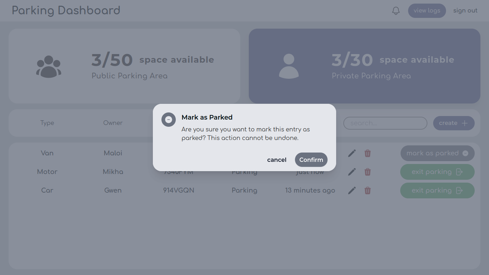
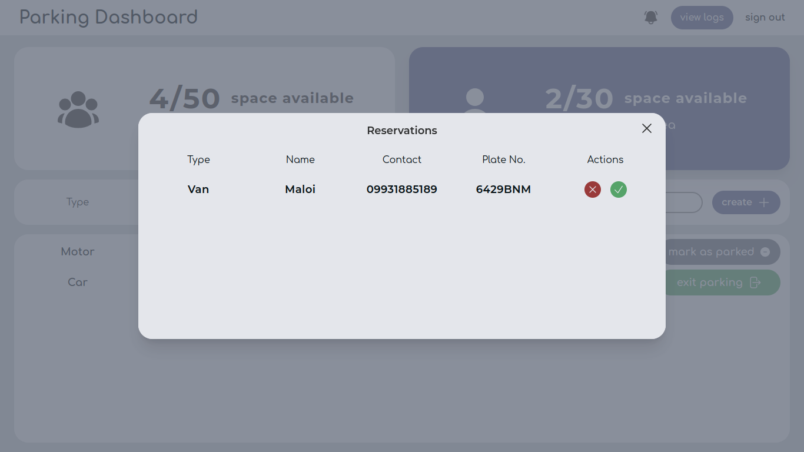
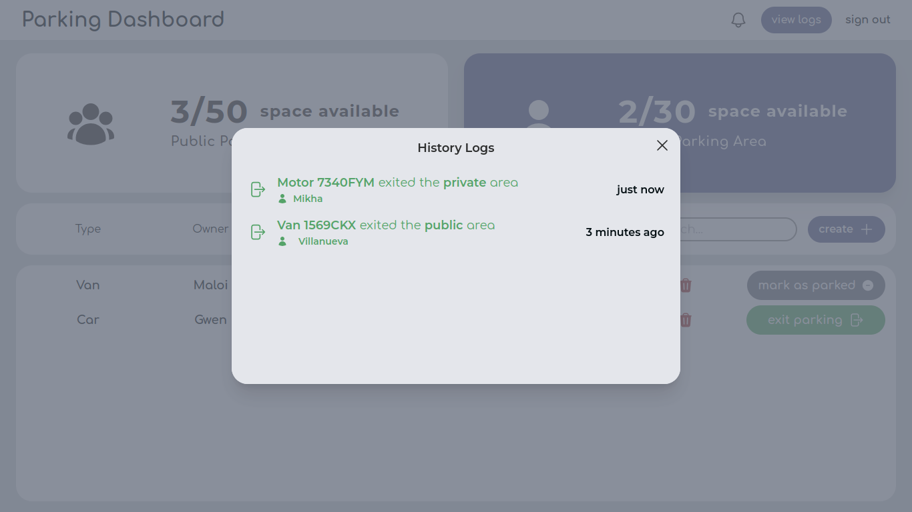

# TODO

types

- MTB
- Road bike
- Fixie
- Gravel Bike
- Tricycle
- EBike
- Bus
- Truck

- documents if full
- details in history logs

# About

## Data Structures and Algorithms project - Parking Management System

_A user-friendly web-admin page for managing parking entries with the following features:_

- Real-time
- Organized
- Reservation Page
- Search features
- History Log

---

## Tools

[Fuse.js](https://www.fusejs.io/) - searching library

[Headless UI](https://headlessui.com/) - ui library

[FontSource](https://fontsource.org/) - fonts library

[HeroIcons](https://heroicons.com/) - Icons library

[ngrok](https://ngrok.com/) - used for http tunneling

---

## screenshots

